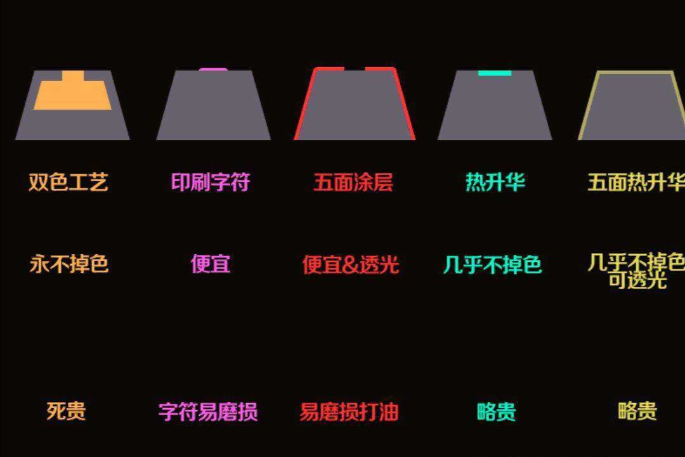

## 客制化相关

<hr>

### 人生第一把客制化键盘唤为`雪音`

*  `老薛家的公模104套件,RGB,热插拔，蓝牙有线双模`

*  `佳达隆G黄(厚润) G白(拉胯) G黑(满意)` 

*  `大碳键帽PBT双色注塑`

>#### 104套件设置（无驱动）：`右win = FN`

- #####   `FN + F1: win + E`
- #####   `FN + F2: Open QQ 浏览器`
- #####   `FN + F3: win10 邮件`
- #####   `FN + F4: open 酷狗 `
- #####   `FN + F5: 上一首音乐`
- #####   `FN + F6: 下一首音乐`
- #####   `FN + F7: 音乐暂停`
- #####   `FN + F8: 退出歌单`
- #####   `FN + F9: 音量增加`
- #####  `FN + F10: 音量减少`
- #####  `FN + F11: 静音切换`
- #####  `FN + F12: 打开计算器`


<br>

```bash
 ┌───┐   ┌───┬───┬───┬───┐ ┌───┬───┬───┬───┐ ┌───┬───┬───┬───┐ ┌───┬───┬───┐
 │Esc│   │ F1│ F2│ F3│ F4│ │ F5│ F6│ F7│ F8│ │ F9│F10│F11│F12│ │P/S│S L│P/B│  ┌┐    ┌┐    ┌┐
 └───┘   └───┴───┴───┴───┘ └───┴───┴───┴───┘ └───┴───┴───┴───┘ └───┴───┴───┘  └┘    └┘    └┘
 ┌───┬───┬───┬───┬───┬───┬───┬───┬───┬───┬───┬───┬───┬───────┐ ┌───┬───┬───┐ ┌───┬───┬───┬───┐
 │~ `│! 1│@ 2│# 3│$ 4│% 5│^ 6│& 7│* 8│( 9│) 0│_ -│+ =│ BacSp │ │Ins│Hom│PUp│ │N L│ / │ │ - │
 ├───┴─┬─┴─┬─┴─┬─┴─┬─┴─┬─┴─┬─┴─┬─┴─┬─┴─┬─┴─┬─┴─┬─┴─┬─┴─┬─────┤ ├───┼───┼───┤ ├───┼───┼───┼───┤
 │ Tab │ Q │ W │ E │ R │ T │ Y │ U │ I │ O │ P │{ [│} ]│ | \ │ │Del│End│PDn│ │ 7 │ 8 │ 9 │   │
 ├─────┴┬──┴┬──┴┬──┴┬──┴┬──┴┬──┴┬──┴┬──┴┬──┴┬──┴┬──┴┬──┴─────┤ └───┴───┴───┘ ├───┼───┼───┤ + │
 │ Caps │ A │ S │ D │ F │ G │ H │ J │ K │ L │: ;│" '│ Enter  │               │ 4 │ 5 │ 6 │   │
 ├──────┴─┬─┴─┬─┴─┬─┴─┬─┴─┬─┴─┬─┴─┬─┴─┬─┴─┬─┴─┬─┴─┬─┴────────┤     ┌───┐     ├───┼───┼───┼───┤
 │ Shift  │ Z │ X │ C │ V │ B │ N │ M │< ,│> .│? /│  Shift   │     │ ↑ │     │ 1 │ 2 │ 3 │   │
 ├─────┬──┴─┬─┴──┬┴───┴───┴───┴───┴───┴──┬┴───┼───┴┬────┬────┤ ┌───┼───┼───┐ ├───┴───┼───┤ E││
 │ Ctrl│    │Alt │         Space         │ Alt│    │    │Ctrl│ │ ← │ ↓ │ → │ │   0   │ . │←─┘│
 └─────┴────┴────┴───────────────────────┴────┴────┴────┴────┘ └───┴───┴───┘ └───────┴───┴───┘
```

> #### 佳达隆的G黄，G黑这两款线性轴不错

!>`RGB PCB 轴体别买下黑壳的影响光污染效果,插灯珠的当然就无所谓了`

?>box 红 = 压力指数更高的G白

!>`G白45g压力手感太轻,同时也容易误触`


<hr>

### 第二把客制化键盘起名 `缪斯Muses`

<br>

* `凯酷84单模粉色套件，RBG，热插拔，带驱动`

* `凯华BOX白轴(字母区) + 厚润佳达隆G黄(常用大键) +  凯华BOX红轴(平常不会按的)`

* `W家的 XDA高度 马卡龙小全套(拉了胯) | CC的XDA高度 PBT材质 球帽`

<hr>


<br>

<!--  -->

>#### KC84说明书设置：

| 键位| 功能 |
| :-- | --:|
| FN+F1 | 我的电脑 |
| FN+F2 | 浏览器 |
| FN+F3 | 计算器 |
| FN+F4 | 音乐播放器 |
| FN+F5 | 上一曲 |
| FN+F6 | 下一曲 |
| FN+F7 | 播放 / 暂停 |
| FN+F8 | 停止 |
| FN+F9 | 静音 |
| FN+F10 | 减小音量 |
| FN+F11 | 加大音量 |
| FN+F12 | 锁WIN键 |
| FN+PrtSc(截图键) | 切换副键盘数字区 |
| FN+Pause | Scroll键 |
| FN+DEl | lnsert键 |

<hr>


<style>
    table{
        margin: 0 auto;
    }
</style>

<!-- 
 ------------------
        \   ^__^
         \  (oo)\_______
            (__)\       )\/\
                ||----w |
                ||     ||

 -->